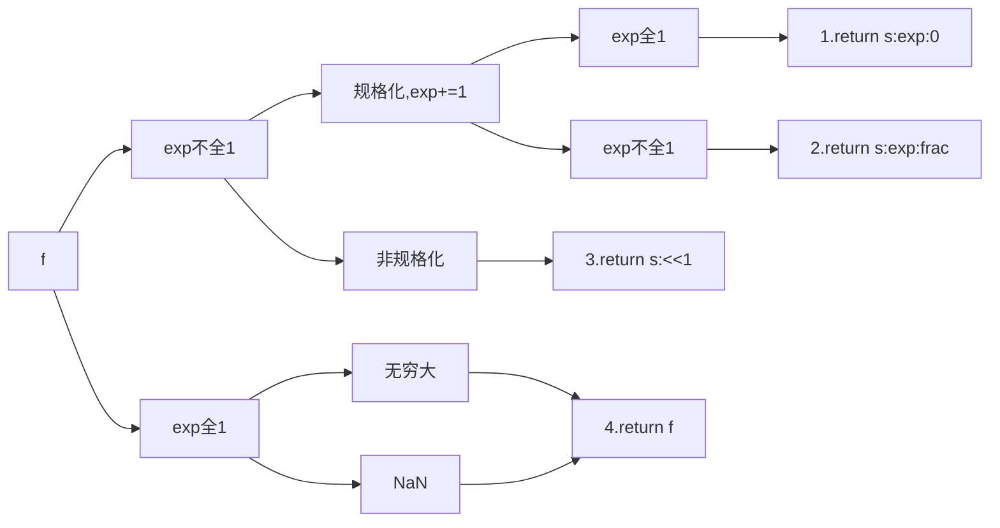

# Lab1: Datalab

## 1.1 bitXor

```c
/* 
 * bitXor - x^y using only ~ and & 
 *   Example: bitXor(4, 5) = 1
 *   Legal ops: ~ &
 *   Max ops: 14
 *   Rating: 1
 */
```

$\begin{array}{c|cc}\&&0&1\\\hline 0&0&0\\1&0&1\end{array}$ 与 $\begin{array}{c|cc}.&0&1\\\hline \sim&1&0\end{array}$综合使用，最终变换得到 $\begin{array}{c|cc}\wedge&0&1\\\hline 0&0&1\\1&1&0\end{array}$ 

```c
int bitXor(int x, int y) {
  return ~(x&y)&~(~x&~y);
}
```

## 1.2 tmin

```c
/* 
 * tmin - return minimum two's complement integer 
 *   Legal ops: ! ~ & ^ | + << >>
 *   Max ops: 4
 *   Rating: 1
 */
```

实验环境设定int为32位，最小的补码是1跟31个0；

```c
int tmin(void) {
  return 1<<31;
}
```

## 1.3 isTmax

```c
/*
 * isTmax - returns 1 if x is the maximum, two's complement number,
 *     and 0 otherwise 
 *   Legal ops: ! ~ & ^ | +
 *   Max ops: 10
 *   Rating: 2
 */
```

补码最大值：0跟31个1

特点：+1后变成tmin^1跟31个0^，取补后^0跟31个1^与自身$\wedge$得到全0，取!后得到1；
$$
!(\sim(x+1)\wedge x)
$$
但是由于-1^全1^+1=0^全0^，取补后^全1^与自身$\wedge$得到全0，取!后也能得到1，需要特判;

-1+1=0, tmax+1=tmin, 前者两次取!得到0，后者两次取!得到1，即：$!!(x+1)$

```c
int isTmax(int x) {
  return !(~(x+1)^x)&!!(x+1);
}
```

## 1.4 allOddBits

```c
/* 
 * allOddBits - return 1 if all odd-numbered bits in word set to 1
 *   Examples allOddBits(0xFFFFFFFD) = 0, allOddBits(0xAAAAAAAA) = 1
 *   Legal ops: ! ~ & ^ | + << >>
 *   Max ops: 12
 *   Rating: 2
 */
```

判断结果是否与0xAAAAAAAA相同即可；

0xAAAAAAAA不能直接使用，可以通过移位运算、或运算 来得到；

判断是否相同，可以先^，如果相同结果为0，否则不为0；然后取!

由于不在乎偶数位的情况，所以需要先对x进行一个掩码遮罩

```c
int allOddBits(int x) {
  int a = 0xAA<<8|0xAA;
  int b = a<<16|a;  //b==0xAAAAAAAA
  return !((x&b)^b);
}
```

## 1.5 negate

```c
/* 
 * negate - return -x 
 *   Example: negate(1) = -1.
 *   Legal ops: ! ~ & ^ | + << >>
 *   Max ops: 5
 *   Rating: 2
 */
```

在书中的练习里，已经得到过结论：$\sim x = -x-1$

这里只需要对这个式子进行一点变换即可

```c
int negate(int x) {
  return ~x+1;
}
```

## 1.6 isAsciiDigit

```c
/* 
 * isAsciiDigit - return 1 if 0x30 <= x <= 0x39 (ASCII codes for characters '0' to '9')
 *   Example: isAsciiDigit(0x35) = 1.
 *            isAsciiDigit(0x3a) = 0.
 *            isAsciiDigit(0x05) = 0.
 *   Legal ops: ! ~ & ^ | + << >>
 *   Max ops: 15
 *   Rating: 3
 */
```

分析[0x30, 0x39]，对三类值分别判断

```c
int isAsciiDigit(int x) {
  int a = !((~0x7&x)^0x30); //x=00110xxx,a=1
  int b = !(x^0x38);	//x=00111000,b=1
  int c = !(x^0x39);	//x=00111001,c=1
  return a|b|c;
}
```

## 1.7 conditional

```c
/* 
 * conditional - same as x ? y : z 
 *   Example: conditional(2,4,5) = 4
 *   Legal ops: ! ~ & ^ | + << >>
 *   Max ops: 16
 *   Rating: 3
 */
```

判断x为0或非0，使用!，得到1或0，+~0得到全0和全1，以此为掩码

```c
int conditional(int x, int y, int z) {
  int a = !x+~0;  //x==0,a=0000;x!=0,a=1111
  return (a&y)|(~a&z);
}
```

## 1.8 isLessOrEqual

```c
/* 
 * isLessOrEqual - if x <= y  then return 1, else return 0 
 *   Example: isLessOrEqual(4,5) = 1.
 *   Legal ops: ! ~ & ^ | + << >>
 *   Max ops: 24
 *   Rating: 3
 */
```

原来想直接判断$x-y<=0$，需要判断<0和==0，改成判断$0<=y-x$，只用判断符号位是否为0；

又$-x=\sim+1$，所以$y-x=y+\sim x+1= a$，判断a的符号位，为0返回1

但是相减可能溢出，需要排除异号相减的情况：查看x、y的符号位，$\wedge$后为1则判断x的符号位是否为1，为1返回1;

注意：对补码右移去符号位，得到全0或全1.

```c
int isLessOrEqual(int x, int y) {
  int s1 = x>>31;
  int s2 = y>>31;
  int s = s1^s2;    //异号直接出结果，异号s全1
  int a = y+~x+1;   //同号，x<=y only when a的符号位为0
  int b = !(a>>31);//a的符号位为0，则b=1
  return (!!(s&s1))|((!s)&b);
}
```

## 1.9 logicalNeg

```c
/* 
 * logicalNeg - implement the ! operator, using all of 
 *              the legal operators except !
 *   Examples: logicalNeg(3) = 0, logicalNeg(0) = 1
 *   Legal ops: ~ & ^ | + << >>
 *   Max ops: 12
 *   Rating: 4 
 */
```

当x!=0时，返回1，此时又x<0和x>0两种情况：

1. x<0，此时x的符号位为1；
2. x>0，此时x不为0，即，取补+1的符号位不为0；

```c
int logicalNeg(int x) {
  int a = ~(x>>31);//x<0,then a=0;else a=1
  int b = ((~x+1)>>31)+1;//when x>=0, x!=0,then a=0;else a=1
  return a&b;
}
```

## 1.10 howManyBits

```c
/* howManyBits - return the minimum number of bits required to represent x in
 *             two's complement
 *  Examples: howManyBits(12) = 5
 *            howManyBits(298) = 10
 *            howManyBits(-5) = 4
 *            howManyBits(0)  = 1
 *            howManyBits(-1) = 1
 *            howManyBits(0x80000000) = 32
 *  Legal ops: ! ~ & ^ | + << >>
 *  Max ops: 90
 *  Rating: 4
 */
```

1. 根据补码的定义很容易知道，n位补码表示的范围是[-2^n-1^, 2^n-1^-1]。问题的关键是，怎么找到这个n。

① $-2^{n-1}<=x$，解得$n>=log_2(-x)+1$        ==(-x)可能溢出==

② $x<=2^{n-1}-1$，解得$n>=log_2(x+1)+1$  ==(x+1)可能溢出==

为解决溢出问题，由$-x=\sim x+1$有$n>log_2(\sim x)+1$ 与 $n>log_2(x)+1$

2. 当x<0时，满足①即可；当x>=0时，满足②即可。现在的问题是，求$\lceil log_2a+1\rceil$。

x>=0时，符号位为0，值为8，a形如0000 1000，此时i=4，n=5;

x<0 时，符号位为1，值为-1，a形如0000 0000，此时i=0，n=1;

x<0时，符号位为1，值为tmin，a形如0111 1111，此时i=7，n=8;

3. 综上，问题变成了找到从左到右第一个1的位置。

二分查找，如果前16位有1，则在前16位中找，否则在后16位中找；

重复上述过程（16->8->4->2->1->0）

4. 返回b16+b8+b4+b2+b1+b0+1

```c
int howManyBits(int x) {
  int s = x>>31; //x<0,s=全1
  int a = (s&~x) | (~s&x); //x<0,a=-x;s>=0,a=x+1
  int b16, b8, b4, b2, b1, b0;
  b16 = !!(a>>16)<<4; //高16位-》0 or 16
  a >>= b16;
  b8 = !!(a>>8)<<3; //再找8位-》0 or 8
  a >>= b8;
  b4 = !!(a>>4)<<2;
  a >>= b4;
  b2 = !!(a>>2)<<1;
  a >>= b2;
  b1 = !!(a>>1); //最后两位中，较高位是否为1
  b0 = !!(a>>b1);//较低位
  return b16+b8+b4+b2+b1+b0+1;
}
```

## 1.11 float_twice

```c
/* 
 * float_twice - Return bit-level equivalent of expression 2*f for
 *   floating point argument f.
 *   Both the argument and result are passed as unsigned int's, but
 *   they are to be interpreted as the bit-level representation of
 *   single-precision floating point values.
 *   When argument is NaN, return argument
 *   Legal ops: Any integer/unsigned operations incl. ||, &&. also if, while
 *   Max ops: 30
 *   Rating: 4
 */
```

单精度浮点数：


$f*2$在bit-level乘2，只用将f的阶码E加1，也即exp部分+1，即可实现。

所有操作都是针对exp部分，故现需要通过掩码与移位运算分离出exp；



```c
unsigned float_twice(unsigned uf) {
  unsigned f = ~(uf|0x807fffff);   //exp全1，则f=0
  if (f) {
    unsigned a = uf&0x7f800000;    //exp全0，则false
    if (a) {
      unsigned u = uf+0x800000;
      if (~(u|0x807fffff)) {  //exp为1111 1111，则false
        return u;
      }
      return u&0xff800000;
    }
    return (uf&0x80000000)|(uf<<1);
  }
  return uf;
}
```

## 1.12 float_i2f

```c
/* 
 * float_i2f - Return bit-level equivalent of expression (float) x
 *   Result is returned as unsigned int, but
 *   it is to be interpreted as the bit-level representation of a
 *   single-precision floating point values.
 *   Legal ops: Any integer/unsigned operations incl. ||, &&. also if, while
 *   Max ops: 30
 *   Rating: 4
 */
```

一个单精度浮点数f：s:exp:frac，其中s占1bit，exp占8bit，frac占23bit。

将int转换为float，需要从int中提取出符号位sign，阶码的位级表示exp，float的frac；

提取exp和frac时，需要先找到x的最高位1，然后根据最高位1的位置确定exp的大小和frac在int中的分布区间；

提取frac时，还需要注意向偶数舍入round-to-even；

```c
unsigned float_i2f(int x) {
  int sign, i, exp, r2e;
  unsigned xR, res;
  if (!x)
    return x;        //先处理x=0的情况，避免全0导致的死循环
  sign = (x>>31)&1;  //sign是符号位
  if (sign)
    x = ~x+1;        //x变为其绝对值
  xR = x;
  i = 31;             //i是最高有效位
  while (!(xR&0x80000000)) {
    --i;
    xR <<= 1;
  }
  xR <<= 1;           //只关注第一1右边的部分
  exp = 127+i;
  r2e = 0;            //round-to-even
  if ((xR&0x1ff) > 0x100)  //xR的位数>23，需要向偶数舍入
    r2e = 1;
  if ((xR&0x3ff) == 0x300) //frac的末尾为1，且次末位也为1，需要向偶数舍入
    r2e = 1;
  res = (sign<<31)+(exp<<23)+(xR>>9)+r2e;
  return res;
}
```


## 1.13 float_f2i

```c
/* 
 * float_f2i - Return bit-level equivalent of expression (int) f
 *   for floating point argument f.
 *   Argument is passed as unsigned int, but
 *   it is to be interpreted as the bit-level representation of a
 *   single-precision floating point value.
 *   Anything out of range (including NaN and infinity) should return
 *   0x80000000u.
 *   Legal ops: Any integer/unsigned operations incl. ||, &&. also if, while
 *   Max ops: 30
 *   Rating: 4
 */
```

先提取出f的符号位，然后得到x的绝对值，最后根据符号进行转换即可；

对uf可以提取出sign，E，frac，其中，sign决定结果需不需要取绝对值，E用来判断frac的有效位及有无溢出，frac的有效位用来赋予int

```c
int float_f2i(unsigned uf) {
  int sign = (uf>>31)&1;
  int E = ((uf&0x7f800000)>>23) - 127;
  int frac = (uf&0x7fffff)|0x800000;   //'|'用来不上默认的最高位
  if (E < 0)
    return 0;  //E<0,x<1，最后舍入得到0
  if (E > 31)
    return 0x80000000;  //out of range, return this
  if (E < 23)
    frac = (frac>>(23-E));  //小数位右移相应位数得到x的右部
  else if (E > 23)
    frac = (frac<<(E-23));  //小数位左移
  frac = frac&(1<<E);
  if (sign) //对负数进行转化
    return ~frac+1;
  else
    return frac;
}
```

